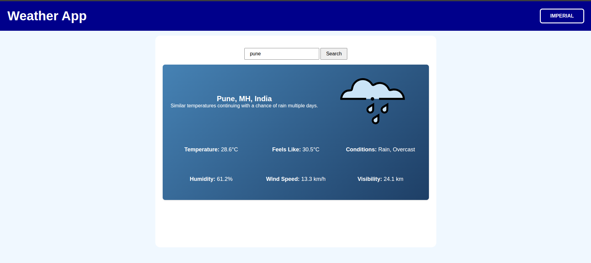

# Weather App

A clean, minimalist weather application that displays current conditions with dynamic backgrounds and unit conversion.

## Features ✨

- 🌤️ Real-time weather data for any location
- 🌡️ Temperature unit toggle (Celsius/Fahrenheit)
- 🎨 Dynamic background based on weather conditions
- 📱 Responsive design for all devices
- ⚡ Fast loading with visual indicators

## Technologies Used 🛠️

- JavaScript (ES6+)
- Visual Crossing Weather API
- Webpack (for bundling)
- CSS Grid/Flexbox
- Modern DOM manipulation
- Eslint and Prettier

